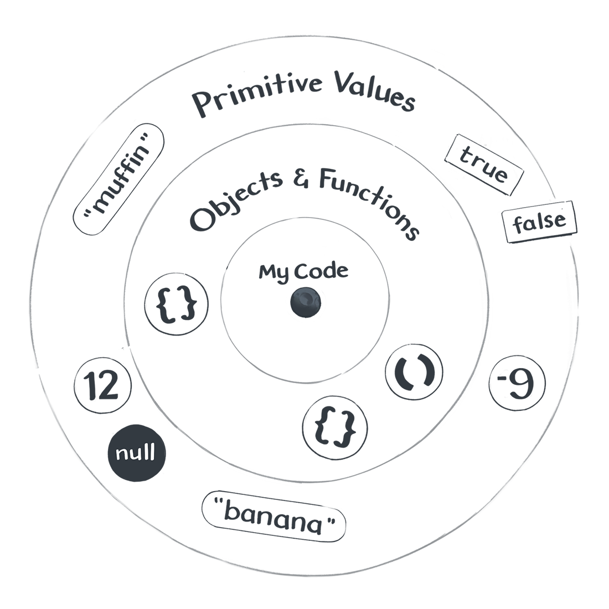

# L'univers Javascript

_Basé sur [Just Javascript](https://justjavascript.com/), de [Dan Abramov](https://twitter.com/dan_abramov)._

## Votre planète

Dans du code, il y a des valeurs, des expressions, des mots-clés, des instructions...

Les valeurs sont fondamentales, et méritent une attention particulière.

Dan Abramov parle du Petit Prince, de St Éxupéry.


Vous êtes sur une petite planète: votre code.

Il y a des déclarations de variables, des boucles, des conditions, des appels à des fonctions...

Mais les valeurs, elles, sont plus haut, dans le ciel.

**Les valeurs n'existent pas dans le code**.

[](https://illustrated.dev/)

## Les étoiles

### Valeurs primitives

Nombres, booléens, strings...

```js
console.log(5);
console.log('romain');
console.log(undefined);
```

Elles sont comme des étoiles: lointaines, **mon code ne peut pas les affecter**, mais je peux toujours les regarder.

### Objets et fonctions

```js
console.log({});
console.log([]);
console.log(() => 1);
```

Elles sont comme les roches de l'anneau de Saturne, proches de votre planète. **Je peux les manipuler depuis mon code**.

## Expressions

Ces sont les questions auxquelles Javascript peut répondre.

```js
2 + 2;

console.log(2 + 2); // 4
```

**Une expression renvoie toujours une seule valeur.**

### Vérifier le type

`typeof` permet de vérifier le type d'une valeur. C'est un opérateur qui permet de construire une question, une expression.

Vous pouvez voir ça comme un télescope qui, posé sur votre planète, regarde les étoiles.

```js
typeof 2;
typeof 'romain';
```

### _<span style="color:royalblue">Essayez de trouver le plus de types possible.</span>_

## Types

**Il y a 9 types en Javascript.**

Et c'est tout.

### Valeurs primitives

- Undefined (`undefined`): pour les valeurs non définies par erreur.
- Null (`null`): pour les valeurs non définies intentionellement.
- Booléens (`true`, `false`): pour la logique
- Nombres (`1`, `4.5`, ...): pour les maths
- Strings (`a`, `romain`, ...): pour le texte
- Symbols (abstrait): pour cacher des choses
- BigInt (nouveau): pour les maths sur de grands nombres

### Objets et fonctions

- Objets (`{}`, ...): pour regrouper des données
- Functions (`() => 1`, ...): pour faire référence à du code

#### _La suite: [Valeurs et variables](./1-3_variables.md)_
