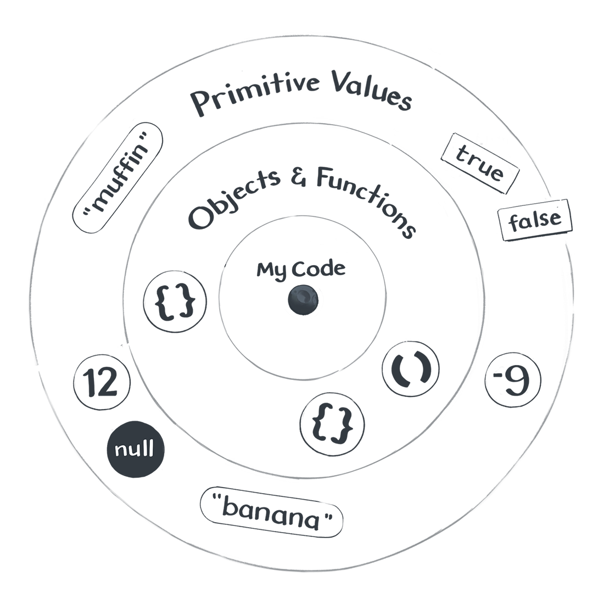

# L'univers Javascript

Basé sur [Just Javascript](https://justjavascript.com/), de [Dan Abramov](https://twitter.com/dan_abramov).

## Le modèle mental

On va définir un modèle mental.

Réfléchir à comment vous interprétez le code suivant, avec des mots humains.

```js
let a = 10;
let b = a;
a = 0;
```

Quel est votre monologue, votre façon de décrire le code ?

## L'univers Javascript

Dans du code, il y a des valeurs, des expressions, des mots-clés, des instructions...

Les valeurs sont fondamentales, et méritent une attention particulière.

Dan Abramov parle du Petit Prince, de St Éxupéry.


Vous êtes sur un petit astéroïde: votre code.

Il y a des déclarations de variables, des boucles, des conditions, des appels à des fonctions...

Mais les valeurs, elles, sont plus haut, dans le ciel.

**Les valeurs n'existent pas dans le code**.



### Valeurs primitives

Nombres, booléens, strings...

```js
console.log(2);
console.log('hello');
console.log(undefined);
```

Elles sont comme des étoiles: lointaines, **mon code ne peut pas les affecter**, mais je peux toujours les regarder.

## À suivre: [DOM](./dom.md)
